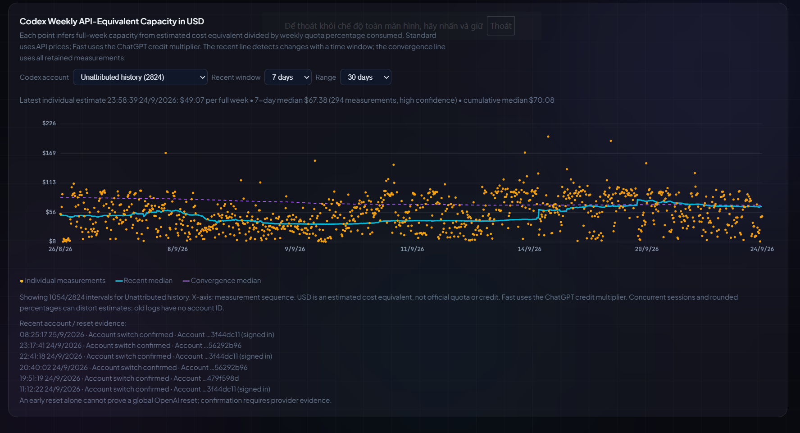
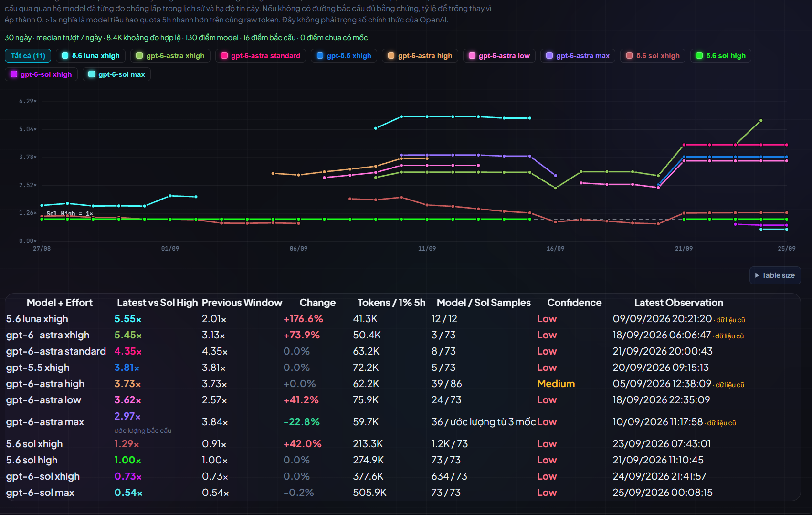
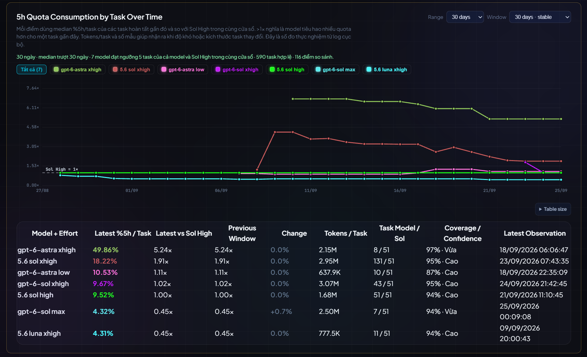
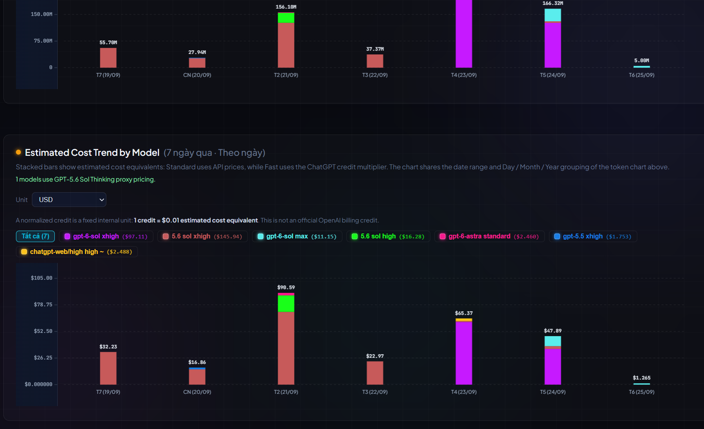

# Usage Tracker

> Track usage, quota, costs, and task-level efficiency for Codex, Gemini/Antigravity, and Windows-based AI coding workflows — running locally on your machine.

[Tiếng Việt](README.md) · **English**

This dashboard tracks practical metrics for managing your AI quota.

> These are real Usage Tracker captures from September 25, 2026. Values vary by account, model, and measurement time. USD figures are estimated cost equivalents, not Codex invoices.

## Automatic Model Leaderboard Updates

With an API key, the leaderboard checks the [Artificial Analysis Data API](https://artificialanalysis.ai/data-api/docs) when dashboard data loads and its last snapshot is over 24 hours old. It retains the last valid snapshot for offline use. Set `ARTIFICIAL_ANALYSIS_API_KEY` for the server process, or put the key on one line in `C:\Users\<username>\.codex\usage-tracker-aa-api-key.txt`, outside the served web directory. The snapshot is Git-ignored; the key is never sent to the browser. Restart the server and reload the page after adding a key. Without one, the dashboard shows the latest dated, verified offline snapshot. Codex picker models without an AA score stay visible but unranked. API and Codex prices remain separate from AA benchmarks.

## What Makes Usage Tracker Different

If you follow AI discussions on X, you have likely come across the idea of pairing Sol as an orchestrator with Luna as an executor to reduce token usage. In practice, however, savings vary considerably and remain hit-or-miss for most users. Workloads heavy on creative exploration or iterative brainstorming can actually consume more tokens this way. Because efficiency depends entirely on your specific workload, this repository provides a dedicated tool to measure and estimate actual quota consumption for your specific tasks, helping you select models based on data rather than guesswork.

Another example: Tibo (head of Codex) previously noted that Astra would be more economical than Sol. However, empirical measurement reveals that cost strictly depends on the workload:
* **In my specific workflow:** 5.6 Sol Extra High consumes roughly 1.5x compared to Sol High, yet it remains significantly more economical than Astra models (which burn roughly 3x the quota of Sol High). If Sol Extra High's reasoning is sufficient for the task and workload volume is high, running 5.6 Sol Extra High remains the most balanced choice.
* **Verifying early community reports:** Early benchmarks suggested that Astra Extra High / Max consumed less quota than Astra Low / Medium. Real-world testing on my tasks confirmed this: Astra Extra High proved to be the most quota-efficient among Astra configurations, whereas Low and Medium burned substantially more.

To address these measurement needs, Usage Tracker answers concrete operational questions:

* How much quota does Codex have left in the 5-hour and weekly windows?
* Is the displayed number live from the log, or an estimate?
* At what rate is the model burning quota right now?
* What is the typical consumption for comparable tasks?
* Is the task fully resolved, or did it require multiple re-teaching and patch turns?
* When routing through orchestrators, executors, or subagents, which route is billed for the usage?
* Unrecorded cost or usage fields remain `unknown` rather than defaulting to `0`, preventing skewed statistics.

## Charts from Real Usage

**Codex weekly capacity.** Each dot infers a full-week cost-equivalent budget from estimated spend and the percentage of weekly quota used. The recent line responds to new changes, while the convergence line summarizes retained measurements. Account, range, and window controls help keep accounts separate.



**Five-hour quota efficiency over time.** Each model is compared with Sol High for the same raw token count. The table shows sample counts, confidence, and whether the baseline is direct or bridged. A value above 1× means faster quota consumption, not higher model quality.



**Quota cost per task.** This chart compares recently completed tasks with Sol High in the same time window and displays models only after both sides have enough samples. It measures the cost of finishing a task, unlike the per-token burn-rate chart above.



**Tokens and estimated cost by model.** The two stacked-bar charts share the date range and day/month/year grouping. Hover over a bar to see every model in that period. USD values are estimates; Fast variants use the ChatGPT credit multiplier in the equivalent-cost calculation.



The **Average Task Completion Time by Model** chart draws a separate line for each Codex model + effort, with a multi-select legend and a comparison table showing the latest mean, median, and sample counts. It offers 30/90/180-day ranges and 7/14/30-day rolling windows. Only accepted tasks handled from start to finish by one model with complete work timestamps are attributed; mixed-model tasks and separately linked repair missions are excluded. Waiting between turns is excluded. These observed averages are not adjusted for differences in task type or difficulty, and inferred acceptances remain identifiable through the reviewed-sample count.

## Features: Instantaneous vs. Average Usage

The tracker avoids relying on a single total token column, as an isolated number obscures operational realities:

* **Instantaneous usage (current / instantaneous):** Shows the burn rate of a model or task in real time. This helps you monitor progress and decide whether to maintain the current execution route. However, instantaneous values are noisy—they spike during sudden context expansions or prolonged reasoning loops.
* **Average usage (average / typical):** Serves as a baseline for comparable task categories. To filter out anomalies and outliers, the tracker prioritizes median values once sufficient samples are collected.

Combining both metrics provides early warnings when a task exhibits abnormal burn rates while maintaining an empirical baseline to guide model selection.

## Task-to-Quota Correlation Matrix

### a. The Flaw of Single-Turn Metrics
Evaluating models solely by instantaneous burn rate or single-turn token consumption easily leads to misinformed choices:

* **Simple tasks:** Both lightweight and heavier models can resolve the prompt in a single turn. In these cases, opting for a higher effort level (such as Sol Extra High) introduces unnecessary overhead (consuming roughly 1.84x compared to Sol High).
* **Complex tasks (e.g., trading setup training, web development, 3D simulations):**
  * Lightweight models or low-effort profiles (e.g., GPT-5.5 Low, Sol High) appear cheap per turn. However, if the model struggles to grasp requirements, you must repeatedly explain, intervene, and correct incomplete code. Context accumulates across each turn, inflating cumulative token consumption for the overall mission.
  * Conversely, a more capable model (e.g., 5.6 Sol Extra High) incurs a higher per-turn cost, but its reasoning depth often resolves the issue in 1–2 turns without repetitive re-teaching. Across the entire mission lifecycle, total token consumption can actually end up lower.

The tracker therefore evaluates the full amount of usage required to complete a mission. Raw tokens remain available for auditing, while the matrix's primary ratio uses measured Codex five-hour quota consumption. Bridged or estimated values retain their provenance and confidence.

### b. Data Collection and Aggregation Logic
Aggregating data from historical task runs:

* **Single-shot completions:** When a model finishes the task in one attempt with no follow-up revisions required, token usage is captured directly from that session/turn.
* **Multi-turn revisions:** When intervention is needed—including prompt re-teaching, bug fixing, and logic adjustments until the output is accepted—the tracker accounts for every related turn.
* **Cross-model repairs:** A repair stays as its own mission so the repair model keeps its actual usage. That same usage is also charged as a penalty to the model whose failed result required the repair. In a longer repair chain, later repair cost propagates to the failed upstream links instead of collapsing the whole chain into one mixed-model mission.

### c. 2D Matrix Structure
A 2D matrix quantifies the capability and actual cost profile of each `Model + Effort` configuration across specific workloads:

* **Rows (Task Types):** Categorized by real-world workflows:
  * *Trading setup training / reasoning*
  * *Web development*
  * *3D simulation / algorithmic modeling*
  * *(Other domain-specific workflows...)*
* **Columns (Model + Effort):** Benchmarked model configurations (GPT-5.5 Low/High/XHigh, Sol High/XHigh, Astra...).
* **Normalized Baseline:** `Sol High` serves as the `1.00x` baseline.
  * Cell values primarily reflect five-hour quota consumed to complete a mission in the same task category.
  * Ratio `< 1.00x`: Lower five-hour quota consumption than Sol High.
  * Ratio `> 1.00x`: Higher five-hour quota consumption than Sol High.
  * Raw-token ratios remain supporting evidence. A value is bridged only when a supported comparison path exists, and the UI marks its provenance and confidence.
* **Handling Missing Data:** Combinations that have not yet been benchmarked explicitly display `No data` rather than interpolating or defaulting to 0.

### d. Key Takeaways & UI Behavior
* **Quantitative Model Selection:** The matrix provides concrete data on when lighter models are sufficient to conserve quota, and when high-capability models are necessary upfront to prevent costly re-teaching loops.
* **Persistent UI Settings:** Language, filters, models, date ranges, chart units, table sizes, column widths, and the active table sort are retained in browser storage (`localStorage`) between launches. Hover over a column heading to reveal its arrows; click once for ascending order and again for descending order. Sorting survives data refreshes and filter changes. Mixed-metric cells use the primary measure named in the heading tooltip; missing measurements sort last and summary footers remain at the bottom.


## Automated Mission Grouping Is Only a Suggestion

Mission grouping relies on heuristics, which can misjudge mission boundaries or task categories. The dashboard includes a manual review interface to:

- Merge a mission with the preceding one;
- Split the final turn into a new mission;
- Correct task categories;
- Mark outcomes as `accepted`, `unresolved`, or `abandoned`;
- Revert boundaries back to the automated heuristic.

Automation reduces review friction, but an automated inference is never treated as ground truth simply because it was machine-generated.

Automatic rules are intentionally limited to strong evidence: an immediate same-task correction, a model switch that fixes that correction, a separate quota/cost accounting question, or a new request after a long gap. An explicit “continue” prompt still resumes the previous mission. A substantial new request that merely contains a generic follow-up phrase after a long gap starts a new mission. Cross-task repair links require an explicit reference to the earlier task or manual review.

## From Estimated Quota to Live Quota

The initial version relied heavily on local session transcripts. While adequate for historical reconstruction, it could not determine remaining Codex quota in real time.

The tracker has evolved across several layers:

1. Scanning local sessions and normalizing records to prevent double-counting.
2. Separating 5-hour and 7-day windows instead of aggregating into a single quota metric.
3. Reading rate limits directly from the Codex app-server when supported locally.
4. Attaching provenance flags so the UI clearly distinguishes live sources from session-log fallbacks.

A common real-world issue occurred when the desktop process failed to resolve the `codex` executable via `PATH`. The tracker continued running by quietly falling back to session logs, displaying numbers that appeared valid but were stale.

The project adheres to a strict principle: **the live app-server is authoritative when reachable; fallback data remains useful but must be explicitly labeled**.

The Codex quota page includes a **Weekly API-Equivalent Capacity in USD** chart. Each point converts the API-equivalent token cost of one same-session, same-model/effort interval into a full-week estimate using the measured weekly quota percentage change. A cumulative median shows convergence across retained history, while a 7-, 14-, or 30-day median reflects recent measurements. The horizontal axis follows measurement order with date markers. This is an inference at current catalog API prices, not an official USD or credit allowance; concurrent activity, model mix, and price changes can affect it.

For new measurements, the tracker stores the opaque Codex account UUID and live quota snapshots in `~/.codex/usage-tracker-quota-identity.json`, outside the web-served directory. A token log receives an account ID only when it is close to a live snapshot and both 5-hour and weekly reset times agree. Older logs without sufficient evidence stay in a separate unattributed-history group. The account selector keeps medians separate. An observed ID change is an account switch; an early weekly cycle change remains an unverified reset until provider evidence establishes its cause.

## Local Tokens Don’t Always Come from the Same Source

The tracker processes token metrics across distinct ingestion channels:

- Transcript-estimated tokens;
- Exact tokens reported by workers/tool outputs;
- Automatically parsed tokens from Codex session logs;
- Manual/configured values used as fallbacks.

Collapsing these into a single column without provenance makes estimates indistinguishable from exact measurements. The tracker preserves the origin alongside every metric.

Similarly, unknown costs or token usages remain marked as `unknown`. An `unknown` state is never treated as `$0` or `0 tokens`.

## ChatGPT Web and Cached Input

Usage Tracker avoids over-interpreting incomplete telemetry. If a ChatGPT Web source reports `cached_input_tokens = 0`, it means the tracker received no meaningful cache telemetry from that interface; it **does not prove** that caching was inactive on the platform.

Costs for ChatGPT Web are treated as estimates/proxies in the absence of an authoritative telemetry source, and should not be assumed cache-comparable to sources providing full cache telemetry.

## Quick Start & Installation

Requirements:

- Windows 10 or Windows 11.
- Python 3. The tracker prioritizes the Python runtime bundled with Codex if detected, falling back to `py -3` or `python`.
- A modern web browser.
- Node.js is only required for JavaScript linting/testing during development/CI.

From the repository root:

```powershell
.\start.bat
```

Or start the server without opening a browser:

```powershell
powershell -ExecutionPolicy Bypass -File .\start-background.ps1
```

Then open:

```text
http://127.0.0.1:5051/
```

### Why can the first load take time?

**If the page opens while its numbers are still loading:** the server is scanning local Codex/Gemini logs and rebuilding charts and task matrices. With a large history, the first load or a refresh can take tens of seconds; on the maintainer's machine on September 25, 2026 (nearly 40,000 Codex events), `/api/data` took about 24 seconds. This is local processing, not by itself a frozen page. Wait for “Last updated” to show a time; if the API errors or never updates, check the logs under `runtime/`. Actual time depends on history size and hardware. The live dashboard loads the offline `data.js` only when the API is unavailable. By default the API omits two large raw event lists while retaining chart and task results; callers needing the full API export can use `/api/data?include_raw=1`.

Stop or restart the server with:

```powershell
powershell -ExecutionPolicy Bypass -File .\stop-server.ps1
powershell -ExecutionPolicy Bypass -File .\restart-server.ps1
```

The managed PID and runtime logs are stored under `runtime/`.

## Accuracy and Interpreting the Data

Dashboard values do not all have the same certainty. Read the source/provenance shown with each metric:

- **Live / exact:** read directly from a local source that exposes the value.
- **Log-derived:** computed from local sessions or transcripts.
- **Estimated / inferred:** derived from observations or a proxy.
- **Manual / configured:** supplied by the user or retained as a fallback.

Cost and quota-capacity estimates are analysis aids, not official billing records. Task-outcome classification and mission grouping are heuristic, so high-impact or sparse comparisons should be reviewed before they are used as benchmarks.

## Local Data and Privacy

The following files are intentionally excluded by `.gitignore`:

- `accounts.json`
- `codex_usage.json`
- `codex_models_cache.json`
- `codex_mission_turns_cache.json`
- `codex_mission_reviews.json`
- `quota_observations.json`
- `real_quotas.json`
- `time_series_history.json`
- `data.js`
- `runtime/`
- `runtime_backups/`

They may contain account identifiers, prompts, local paths, usage history, or other machine-local data. **Do not use `git add -f` to place these files in a public commit without reviewing their contents.**

The public repository does not require private projects, personal prompt history, or private trading data. The four `2026-09-25` screenshots are real captures supplied by the repository owner; older demo assets use illustrative values. Avoid including private prompts or full account identifiers in future public screenshots.

## Development and Validation

```powershell
node --check app.js
node --check i18n.js
python -B -m unittest discover -v
python -B -m py_compile server.py run_server.py
git diff --check
```

The test suite covers usage sources, quota estimation, the model catalog, Codex task outcomes, and live Codex app-server rate-limit handling. GitHub Actions run the core checks on Windows.

## Contributing, Security, and License

See `CONTRIBUTING.md` for the development and pull-request workflow. Use `SECURITY.md` for security or privacy reports.

License: MIT. See `LICENSE`.
