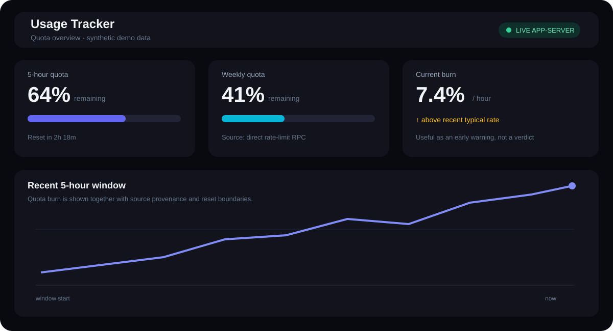
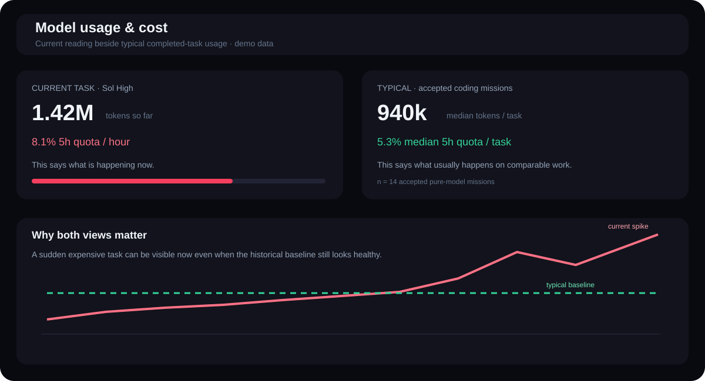
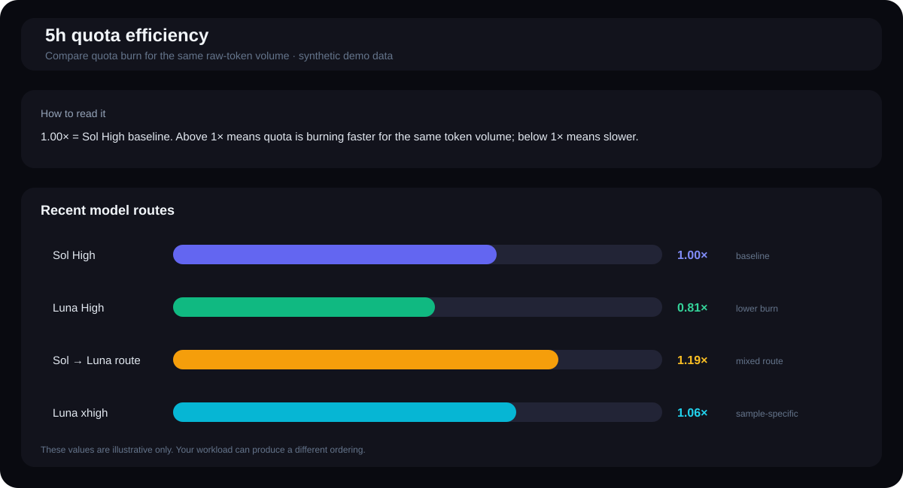
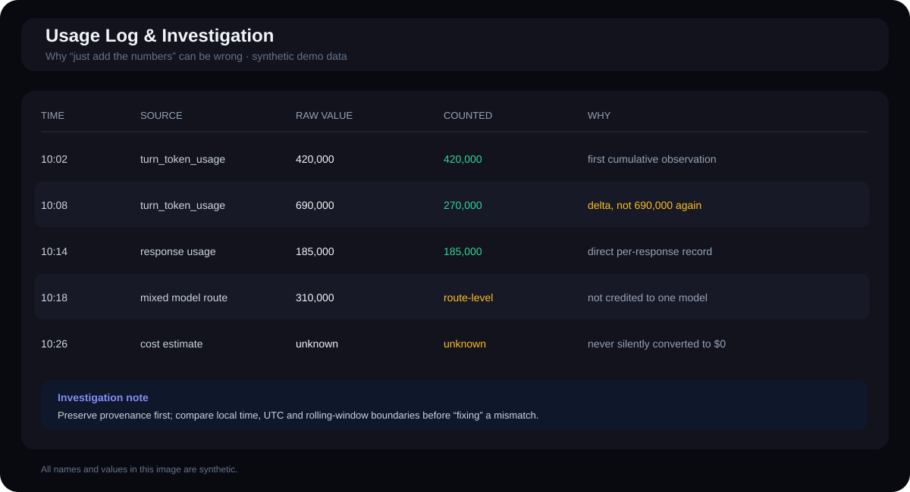
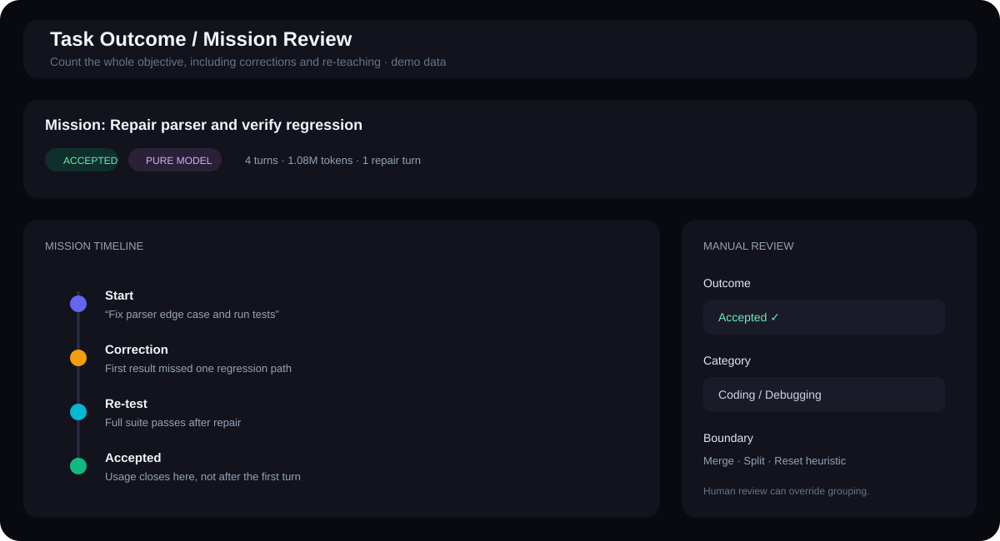
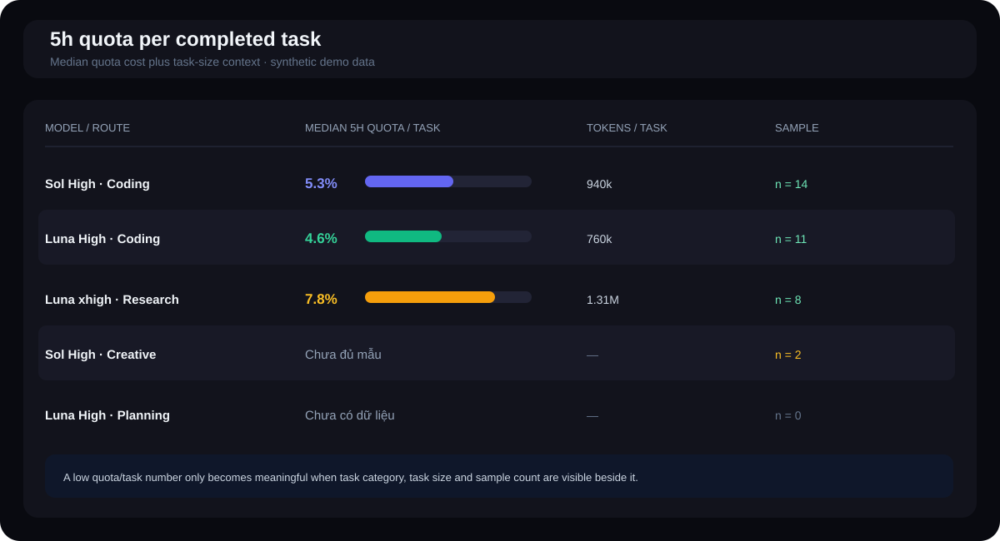

# Usage Tracker

> Local-first usage, quota, cost, and task-outcome analysis for Codex, Gemini/Antigravity, and other coding-assistant workflows on Windows.

[Tiếng Việt](README.md) · **English**

Usage Tracker grew out of a practical question: **which model is actually efficient for my work, and how much quota does a task like this really consume?**

It is not just a token counter. The tracker connects current usage, 5-hour/weekly quota, cost, model routes, and whether a task was actually finished or required several repair and re-teaching turns.

> Screenshots in this README use **synthetic demo data**, not the author's real telemetry.

## Why I built Usage Tracker

At first I only wanted to know how much Codex quota I had left. Then I realized that one quota number or one lifetime token total still did not answer the question I actually cared about.

A model can look very cheap on its first turn, yet the result may not be usable. I may have to correct the prompt, explain the goal again, ask it to continue, or bring in another model to repair the work. If I only count that first turn, the model looks efficient. If I count everything until the result is actually accepted, the story can be very different.

The opposite can also happen: a model may burn quota quickly right now, but for this kind of task it usually finishes with fewer corrections. Looking only at instantaneous usage can also be misleading.

Usage Tracker therefore grew around more practical questions:

- How much Codex quota remains in the 5-hour and weekly windows?
- Is the number live, log-derived, or estimated?
- How fast is this model/task burning quota **right now**?
- For comparable tasks, how much does it **typically** use?
- Was the task actually completed, or did it require repair/re-teaching turns?
- If an orchestrator, executor, or subagent was involved, which route should receive the usage and cost?
- If cost or usage is unknown, can it remain `unknown` instead of silently becoming zero?



## Why both instantaneous and typical usage matter

This is one of the main reasons I did not want the tracker to stop at a single “tokens used” number.

**Instantaneous/current usage** answers: _how fast is this model or task burning quota right now?_ That matters when a long-running task is in progress and you need to decide whether the current route still makes sense.

But a current reading can be noisy. One unusually hard task, one large context load, or one long brainstorming step can spike usage even when that is not the model's normal behavior.

**Average/typical usage** answers a different question: _for similar work, what does this model usually cost?_ Where outliers matter, the tracker prefers robust medians and minimum sample requirements instead of treating one observation as a universal rule.

Average alone is not enough either. A healthy historical average can hide a task that is becoming unusually expensive right now.

That is why the two views belong together:

- **current / instantaneous** tells you what is happening to the task in front of you;
- **average / typical** gives you a baseline for comparable workloads.

One is an early warning; the other is context.



## Why “Sol orchestrator + Luna executor” has no universal saving ratio

One reasonable idea is to use Sol as an orchestrator for planning and reasoning, then let Luna execute cheaper implementation work. On paper, that sounds like it should always save tokens or quota.

In practice, the savings vary a lot by user and workload.

For repetitive, well-scoped tasks with little need to rethink the plan, a cheaper executor can genuinely help. For creative work, brainstorming, research, difficult debugging, or tasks whose requirements keep moving, an orchestrator/executor route may need to resend context, restate goals, repair executor mistakes, and coordinate additional turns. The total usage can end up similar to — or even higher than — using one stronger model end to end.

So Usage Tracker does not assume a formula such as “Luna always saves X%.” **Different people have different workloads, so the saving ratio is workload-dependent.**

The tracker measures your own completed tasks, groups them by task type and route, and shows how much quota those workflows actually consumed. That gives you a way to choose models using your own evidence rather than someone else's universal coefficient.



## Some obvious-looking accounting methods are wrong

This is surprisingly easy to get wrong if you simply open a log and add every number you see.

Imagine a car odometer reading 100 km, then 130 km, then 150 km. You cannot add `100 + 130 + 150` and conclude that the car travelled 380 km. Those are cumulative readings; the real consumption is the delta between observations.

Codex logs can contain the same kind of trap. Fields such as `thread_token_usage` and `turn_token_usage` can be cumulative counters. Summing each value as if it were an independent increment can massively overstate total usage.

The current rule is:

- prefer per-response usage when `token_usage_record.payload.usage.total_tokens` is available;
- when only cumulative counters are available, derive chronological deltas;
- when daily totals disagree, check local time, UTC, and rolling-window boundaries before changing the formula.

That is only one failure mode. Other ways to make a benchmark look better than reality include:

- assigning an entire mixed-model or subagent route to the final model;
- counting a cheap first turn while ignoring the repair and re-teaching turns needed to finish the job;
- turning unknown cost/usage into zero;
- comparing isolated turns instead of the complete objective through acceptance.

Most of the technical machinery in this project exists to prevent those practical measurement mistakes, not to make the dashboard look complicated.



## From individual turns to complete missions

If a task starts with one prompt and later includes corrections, follow-ups, “continue” requests, re-teaching, or another model repairing earlier work, comparing turns in isolation can be misleading.

Usage Tracker therefore uses the concept of a **mission**: one objective from its beginning until it is accepted, abandoned, or remains unresolved.

The mission scanner attempts to:

- read both Codex `sessions` and `archived_sessions`;
- group related corrections/follow-ups into the same objective;
- preserve model, effort, and route instead of reducing everything to an anonymous token total;
- attach delegated work to the parent task when enough evidence exists;
- mark model-switching or delegated routes as `pure_model=false`, so one model does not receive all of the credit and cost.

The useful question becomes: **from the first request until I accepted the result, how much did this route consume and how many repair turns did it require?**



## The efficiency matrix is deliberately conservative

Once missions exist, models can be compared by task category. This is also where it is easy to create an impressive-looking benchmark from too little data.

The matrix only accepts missions that satisfy:

```text
accepted && pure_model && total_tokens > 0
```

Each model × task-type cell needs at least 3 samples before it is treated as adequately sampled. A never-observed cell is shown as `No data`. A sparse cell is shown as `Insufficient samples (n=...)`.

The tracker does not borrow a coefficient from another task category to fill the gap. `Sol High` is currently used as a baseline only inside the same category and eligible dataset; that is not a claim that Sol High is universally the best model.



## Automatic grouping is only a suggestion

Mission grouping is heuristic, so the tracker can guess the wrong boundary or task category. The dashboard therefore includes manual review controls to:

- merge a mission with the previous mission;
- split the final turn into a new mission;
- correct the task category;
- mark `accepted`, `unresolved`, or `abandoned`;
- restore heuristic boundaries.

Automation should reduce review work, not convert a guess into ground truth simply because a machine produced it.

## From quota guessing to a live quota source

Early versions relied heavily on local sessions and transcripts. Those records are useful for reconstructing history, but they are not enough to answer the live Codex-quota question with confidence.

The tracker therefore evolved in layers:

1. Scan local sessions and normalize records to reduce double counting.
2. Keep the 5-hour and 7-day windows separate.
3. When the local Codex runtime supports it, read rate limits directly from the Codex app-server.
4. Preserve provenance so the UI can distinguish a live source from a session-log fallback.

One real bug made this distinction important: a desktop process sometimes could not discover the `codex` executable through `PATH`. The tracker still ran, but silently fell back to older session-log data. The number looked plausible while being stale.

The project now follows a simple rule: **the live app-server is authoritative when available; fallbacks remain useful but must be labeled clearly.**

## Why quota calibration cannot depend on one percentage entry

The tempting way to estimate capacity is to enter one remaining-quota percentage and solve backwards. In practice, IDE percentages may be rounded, observations may belong to different reset cycles, token evidence may come from different sources, and one noisy point can push an estimator far in the wrong direction.

Each manual entry is therefore treated as **one observation**, not ground truth. The estimator uses multiple observations, prefers same-cycle pairs, respects percentage-rounding ranges, isolates reset boundaries, lets old evidence expire gradually, keeps capacity separated by source, and preserves a prior when new evidence is insufficient.

One observation can anchor the estimate; consistent observations are needed to move it with confidence.

## Evidence sources stay separate

“Tokens” on a local machine can come from different kinds of evidence:

- transcript-estimated tokens;
- exact tokens from worker/report data;
- automatically scanned Codex session-log tokens;
- manual/configured fallback values.

Flattening all of them into one unlabeled column makes an estimate look identical to an exact measurement. Usage Tracker therefore keeps provenance attached to the value.

Likewise, unknown cost or usage stays `unknown`. Unknown is not the same as `$0` or `0 tokens`.

## ChatGPT Web and cached-input telemetry

Usage Tracker also avoids inferring more than a source can prove. If a ChatGPT Web source reports `cached_input_tokens = 0`, that only means useful cache telemetry is unavailable to this tracker; it does **not** prove the platform did not use caching.

ChatGPT Web cost is therefore treated as an estimate/proxy when no authoritative equivalent is available, and it should not be presented as directly cache-comparable with a source that exposes cache-aware telemetry.

## Vietnamese / English UI

The dashboard supports `Tiếng Việt` and `English` from the header. The selected language is stored in the browser and dynamic views re-render when it changes, including tables, quota status, toasts, dialogs, canvas charts, and mission-review screens.

The documentation is also split into two real files:

- `README.md` — Vietnamese;
- `README.en.md` — English.

Terms such as `usage`, `quota`, `token`, `mission`, `baseline`, `rolling window`, and `orchestrator/executor` are intentionally left in English when translating them would make the Vietnamese version harder to read.

## Data sources the tracker can read

- Codex local sessions/transcripts.
- Codex app-server rate-limit RPC when the local Codex runtime is compatible and available.
- Gemini/Antigravity local transcripts and account metadata when detected.
- Manual/configured data where a fallback is supported.

Usage Tracker does not require a hosted backend. The UI currently loads Google Fonts from the public Google Fonts CDN; an avatar URL may be displayed when local account metadata provides one.

## Requirements and quick start

Current requirements:

- Windows 10 or Windows 11.
- Python 3. Usage Tracker prefers a Python runtime bundled with Codex when one is available, then falls back to `py -3` or `python`.
- A modern browser.
- Node.js is only required for JavaScript syntax checks during development/CI.

From the repository directory:

```powershell
.\start.bat
```

Or start the server without opening a browser:

```powershell
powershell -ExecutionPolicy Bypass -File .\start-background.ps1
```

Then open:

```text
http://127.0.0.1:5050/
```

Stop or restart the server with:

```powershell
powershell -ExecutionPolicy Bypass -File .\stop-server.ps1
powershell -ExecutionPolicy Bypass -File .\restart-server.ps1
```

Runtime PID and server logs are stored under `runtime/`.

## Accuracy and provenance

Not every number on the dashboard has the same certainty. Read the source/provenance together with the value:

- **Live / exact**: read directly from a local source that exposes the value.
- **Log-derived**: calculated from recorded sessions/transcripts.
- **Estimated / inferred**: derived from observations or proxy data.
- **Manual / configured**: entered or configured by the user as a fallback.

Cost estimates and inferred quota capacities are analytical aids, not official billing records. Task-outcome classification and mission grouping are heuristic; important or low-sample results should be reviewed before being treated as benchmark evidence.

## Local data and privacy

The following files are intentionally excluded by `.gitignore`:

- `accounts.json`
- `codex_usage.json`
- `codex_models_cache.json`
- `codex_mission_turns_cache.json`
- `codex_mission_reviews.json`
- `quota_observations.json`
- `real_quotas.json`
- `time_series_history.json`
- `data.js`
- `runtime/`
- `runtime_backups/`

They may contain account identifiers, prompts, local paths, usage history, or other private machine data. **Do not use `git add -f` on these files before reviewing them yourself.**

The public repository should not contain private projects, personal prompt history, or private trading data.

Images under `docs/screenshots/` use synthetic values and task names.

## Development and tests

```powershell
node --check app.js
node --check i18n.js
python -B -m unittest discover -v
python -B -m py_compile server.py run_server.py
git diff --check
```

The test suite covers major paths including usage sources, quota estimation, the model catalog, Codex task outcomes, and Codex app-server rate-limit handling. GitHub Actions runs core checks on Windows.

## Contributing, security, and license

See `CONTRIBUTING.md` for the development/pull-request workflow and `SECURITY.md` for security or privacy reports.

License: MIT, see `LICENSE`.
