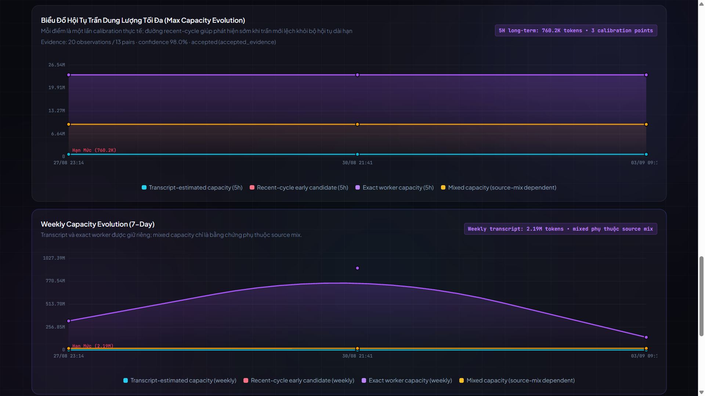
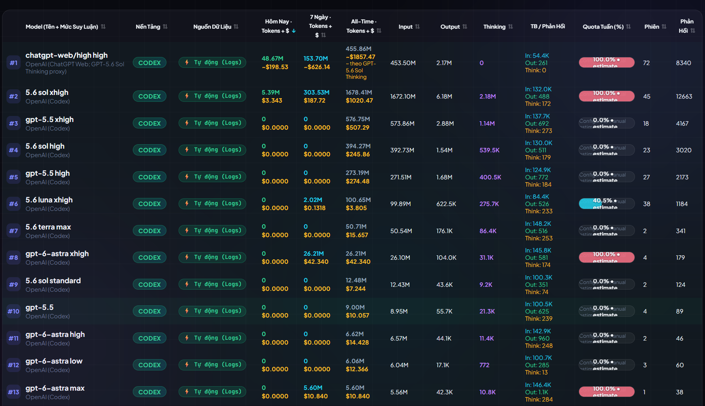
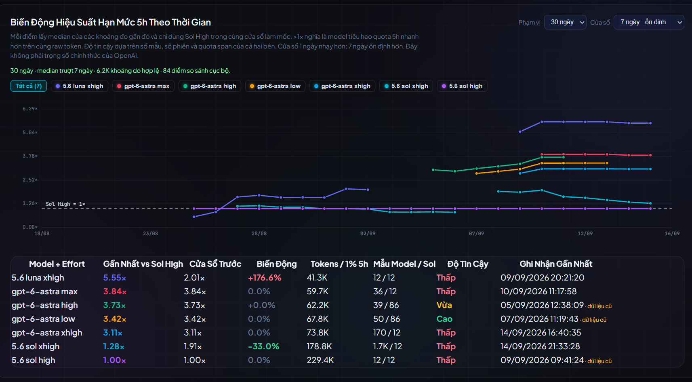
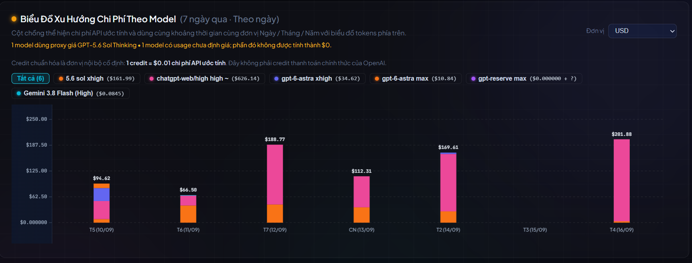

# Usage Tracker

> Theo dõi usage, quota, cost và hiệu quả theo task cho Codex, Gemini/Antigravity và các workflow trợ lý lập trình trên Windows — chạy local trên máy của bạn.

**Tiếng Việt** · [English](README.en.md)

Usage Tracker sinh ra từ một câu hỏi khá đời thường: **mình đang dùng model nào hiệu quả, và một công việc như thế này thực sự ăn bao nhiêu hạn mức?**

Nó không chỉ cộng token. Tracker cố nối từ usage hiện tại, quota 5 giờ/tuần, cost, model route, đến cả việc task đã thực sự xong hay vẫn phải sửa và giảng lại nhiều lượt.

> Các snapshot dưới đây là ảnh chụp trực tiếp từ Usage Tracker sau khi chạy thực tế. Một số ảnh cũ dạng demo vẫn được giữ cho các ví dụ minh họa UI đơn giản.

## Vì sao tôi làm Usage Tracker

Ban đầu tôi chỉ muốn biết Codex còn bao nhiêu hạn mức. Sau đó tôi nhận ra chỉ nhìn một con số quota hoặc một tổng token vẫn chưa trả lời được câu hỏi mình thực sự cần.

Ví dụ, có lúc một model nhìn rất “rẻ” ở lượt đầu. Nhưng kết quả chưa dùng được, mình phải sửa yêu cầu, giải thích lại, bảo nó làm tiếp, hoặc đổi model khác vào cứu. Nếu chỉ tính lượt đầu thì model đó trông rất tiết kiệm; nếu tính cho đến lúc công việc thực sự được chấp nhận thì câu chuyện có thể khác hẳn.

Tôi cũng gặp trường hợp ngược lại: một model đốt quota khá nhanh ngay lúc này, nhưng với đúng loại công việc đó thì nó thường hoàn thành nhanh và ít phải sửa. Chỉ nhìn usage tức thời cũng dễ kết luận sai.

Vì vậy Usage Tracker dần được xây thành một nơi để trả lời các câu hỏi thực tế hơn:

- Codex còn bao nhiêu quota trong khung 5 giờ và khung tuần?
- Con số đang thấy là live, lấy từ log, hay chỉ là estimate?
- Model này đang đốt quota nhanh thế nào **ngay lúc này**?
- Với những task tương tự, nó **thường** tốn bao nhiêu?
- Task đó đã thực sự xong chưa, hay còn phải sửa/re-teach nhiều lượt?
- Nếu có orchestrator, executor hoặc subagent thì cost/usage phải ghi cho route nào?
- Nếu chưa biết cost hay usage thì có thể để là `unknown`, thay vì vô tình biến thành `0` không?



## Vì sao phải nhìn cả usage tức thời lẫn usage trung bình

Đây là một trong những lý do quan trọng nhất khiến tôi không muốn tracker chỉ có một cột “đã dùng bao nhiêu token”.

**Usage tức thời** trả lời câu hỏi: _ngay lúc này model hoặc task này đang đốt hạn mức nhanh đến mức nào?_ Nó rất hữu ích khi bạn đang chạy một task dài và muốn biết có nên tiếp tục route hiện tại hay không.

Nhưng số tức thời dễ nhiễu. Một task khó bất thường, một lần phải đọc context lớn, hoặc một đoạn brainstorm dài có thể làm con số tăng mạnh dù đó không phải hành vi điển hình.

**Usage trung bình/điển hình** trả lời câu hỏi khác: _với loại việc tương tự, model này thường tốn khoảng bao nhiêu?_ Ở những chỗ cần chống outlier, tracker ưu tiên median và yêu cầu đủ mẫu thay vì lấy một điểm đo duy nhất làm kết luận.

Nhưng chỉ nhìn trung bình cũng chưa đủ. Trung bình đẹp có thể che mất một task hiện tại đang tốn bất thường.

Vì thế hai con số phải đi cùng nhau:

- **current / instantaneous** để biết tình hình của task đang chạy;
- **average / typical** để biết điều gì thường xảy ra với loại workload đó.

Một cái cho bạn cảnh báo sớm, một cái cho bạn baseline để so sánh.



## Vì sao “Sol orchestrator + Luna executor” không có một tỷ lệ tiết kiệm cố định

Trước đây có một ý tưởng khá hợp lý: dùng Sol làm orchestrator để suy nghĩ và chia việc, còn Luna làm executor để xử lý phần implementation rẻ hơn. Trên giấy thì cách này có vẻ sẽ luôn tiết kiệm token/quota.

Nhưng khi dùng thực tế, hiệu quả tiết kiệm khá trồi sụt giữa từng người và từng loại công việc.

Với task lặp lại, phạm vi rõ, ít phải suy nghĩ lại, executor rẻ hơn có thể thực sự tiết kiệm. Nhưng với công việc sáng tạo, brainstorm, research, debug khó hoặc yêu cầu thay đổi liên tục, route orchestrator/executor có thể phải truyền lại context, giải thích lại mục tiêu, sửa phần executor làm chưa đúng rồi phối hợp thêm nhiều lượt. Lúc đó tổng usage có thể ngang hoặc thậm chí cao hơn việc dùng một model mạnh làm xuyên suốt.

Vì vậy tôi không muốn Usage Tracker mặc định một công thức kiểu “Luna tiết kiệm X%”. **Workload của mỗi người khác nhau, nên mức tiết kiệm cũng khác nhau.**

Tracker được dùng để đo chính những task của bạn, gom chúng theo loại công việc và route, rồi cho bạn thấy model/workflow nào thực tế đang tiêu tốn bao nhiêu hạn mức. Từ đó bạn chọn model dựa trên dữ liệu của mình, thay vì dựa trên một hệ số chung của người khác.



## Có những cách cộng tưởng đúng nhưng lại sai

Đây là phần tôi thấy rất dễ nhầm nếu chỉ nhìn log rồi cộng số.

Ví dụ đơn giản: nếu đồng hồ quãng đường trên xe lần lượt hiện 100 km, 130 km và 150 km, bạn không thể cộng `100 + 130 + 150` rồi nói xe đã chạy 380 km. Đó là số cộng dồn; phần tăng thực sự chỉ là delta giữa các mốc.

Trong log Codex cũng có trường hợp tương tự. Một số field như `thread_token_usage` hoặc `turn_token_usage` là cumulative counter. Nếu coi mỗi giá trị như một lần tiêu thụ độc lập rồi cộng lại, tổng token sẽ bị phóng đại.

Quy tắc hiện tại là:

- ưu tiên token theo từng response khi nguồn có `token_usage_record.payload.usage.total_tokens`;
- nếu chỉ có cumulative counter thì tính delta theo thứ tự thời gian;
- khi số theo ngày lệch nhau, kiểm tra local time, UTC và rolling-window boundary trước khi sửa công thức.

Đó mới chỉ là một kiểu sai. Còn vài trường hợp khác cũng dễ làm benchmark đẹp nhưng sai:

- route đổi model hoặc có subagent nhưng toàn bộ usage lại bị ghi cho model cuối cùng;
- một first turn rất rẻ nhưng chưa giải quyết xong việc, trong khi các lượt repair/re-teaching bị bỏ khỏi phép tính;
- cost/usage chưa biết bị biến thành `0`, làm model trông rẻ giả;
- chỉ so từng turn thay vì tính từ lúc bắt đầu mục tiêu đến lúc kết quả thực sự được chấp nhận.

Vì vậy phần kỹ thuật trong tracker chủ yếu được sinh ra để tránh các lỗi kiểu này, chứ không phải để làm dashboard phức tạp hơn cho đẹp.



## Từ một turn sang một mission hoàn chỉnh

Nếu một task bắt đầu bằng một prompt, sau đó có sửa yêu cầu, follow-up, “làm tiếp đi”, re-teaching hoặc một model khác vào sửa phần trước, thì so từng turn riêng lẻ rất dễ đánh giá sai.

Usage Tracker vì thế có khái niệm **mission**: một mục tiêu được tính từ lúc bắt đầu cho đến khi nó được chấp nhận, bị bỏ, hoặc vẫn unresolved.

Mission scanner hiện cố gắng:

- đọc cả Codex `sessions` và `archived_sessions`;
- gom các lượt sửa/follow-up liên quan vào cùng mục tiêu;
- giữ model, effort và route thay vì chỉ giữ một tổng token vô danh;
- gắn delegated work về nhiệm vụ cha khi có đủ bằng chứng;
- đánh dấu route có đổi model hoặc delegated work là `pure_model=false`, để không quy toàn bộ công và cost cho một model duy nhất.

Câu hỏi cuối cùng không còn là “turn này hết bao nhiêu token?”, mà là: **từ lúc bắt đầu đến khi tôi chấp nhận kết quả, route này đã tốn bao nhiêu và phải sửa bao nhiêu lần?**


## Ma trận hiệu quả cố tình bảo thủ

Khi đã có mission, tracker có thể so model theo loại công việc. Nhưng đây cũng là chỗ rất dễ tự tạo ra một benchmark trông thuyết phục mà mẫu lại quá ít.

Ma trận chỉ nhận mission thỏa:

```text
accepted && pure_model && total_tokens > 0
```

Mỗi ô model × loại công việc cần ít nhất 3 mẫu trước khi được coi là đủ mẫu. Nếu chưa từng có dữ liệu, UI hiển thị `Chưa có dữ liệu`. Nếu đã có nhưng còn ít, UI hiển thị `Chưa đủ mẫu (n=...)`.

Tracker không lấy hệ số của một loại task khác để lấp vào chỗ đang thiếu. `Sol High` hiện được dùng làm baseline trong cùng category và cùng tập dữ liệu đủ điều kiện; điều đó không có nghĩa Sol High được tuyên bố là model tốt nhất nói chung.


## Tự động phân nhóm chỉ là gợi ý

Mission grouping dùng heuristic nên sẽ có trường hợp đoán sai ranh giới hoặc sai loại công việc. Vì thế dashboard có phần review thủ công để:

- ghép mission với mission trước;
- tách lượt cuối thành mission mới;
- sửa category;
- xác nhận `accepted`, `unresolved` hoặc `abandoned`;
- trả ranh giới về heuristic tự động.

Automation ở đây giúp giảm công kiểm tra, nhưng không được phép biến một suy đoán thành ground truth chỉ vì máy tự sinh ra nó.

## Từ quota đoán sang quota live

Phiên bản đầu tiên dựa nhiều vào session/transcript cục bộ. Nó hữu ích để tái dựng lịch sử, nhưng không đủ để trả lời chắc chắn Codex còn bao nhiêu quota ngay lúc này.

Tracker được mở rộng theo từng lớp:

1. Quét session cục bộ và chuẩn hóa record để hạn chế đếm trùng.
2. Tách khung 5 giờ và 7 ngày thay vì gộp thành một con số quota chung.
3. Khi local Codex hỗ trợ, đọc rate-limit trực tiếp từ Codex app-server.
4. Gắn provenance để UI phân biệt live source với fallback từ session log.

Một lỗi thực tế từng gặp là tiến trình desktop không tìm thấy executable `codex` theo `PATH`. Tracker vẫn chạy, nhưng âm thầm rơi về session-log fallback, khiến số trông hợp lý nhưng đã cũ.

Từ đó dự án giữ nguyên tắc: **live app-server là nguồn có thẩm quyền khi kết nối được; fallback vẫn hữu ích nhưng phải được ghi nhãn rõ ràng**.

## Vì sao quota calibration không thể dựa vào một lần nhập %

Cách dễ nhất để ước lượng capacity là nhập một phần trăm quota còn lại rồi suy ngược ra toàn bộ dung lượng. Nhưng phần trăm trong IDE có thể bị làm tròn; hai lần đọc có thể nằm ở hai reset cycle khác nhau; token source có thể khác nhau; và một điểm đo nhiễu có thể kéo estimator đi sai rất xa.

Vì vậy mỗi lần nhập chỉ được xem là **một observation**. Estimator dùng nhiều quan sát, ưu tiên cặp cùng cycle, xét khoảng làm tròn, tách reset boundary, để bằng chứng cũ hết hiệu lực dần, giữ capacity riêng theo source và giữ prior khi bằng chứng mới chưa đủ mạnh.

Nói đơn giản: một điểm đo chỉ giúp neo mô hình; nhiều điểm nhất quán mới đủ để thay đổi kết luận.

## Không trộn các loại bằng chứng

“Token” trên máy không phải lúc nào cũng đến từ cùng một nguồn. Tracker có thể gặp:

- transcript-estimated token;
- exact token từ worker/report;
- token đọc tự động từ Codex session log;
- số manual/configured dùng làm fallback.

Nếu dồn tất cả vào một cột mà không giữ provenance, một estimate và một exact measurement sẽ trông giống hệt nhau. Vì thế tracker cố giữ nguồn đi cùng số liệu.

Tương tự, nếu cost hoặc usage chưa biết thì phải giữ là `unknown`. `Unknown` không đồng nghĩa với `$0` hay `0 token`.

## ChatGPT Web và cached input

Usage Tracker cũng cố tránh kết luận quá mức từ telemetry thiếu dữ liệu. Nếu một nguồn ChatGPT Web cho `cached_input_tokens = 0`, điều đó chỉ có nghĩa tracker không nhận được cache telemetry hữu ích từ nguồn đó; nó **không chứng minh** nền tảng không dùng cache.

Vì vậy cost của ChatGPT Web được xem là estimate/proxy khi không có authoritative source tương ứng, và không nên giả vờ rằng nó cache-comparable với một nguồn có cache telemetry đầy đủ.

## Tiếng Việt / English trong app

UI hỗ trợ `Tiếng Việt` và `English` ngay trên header. Lựa chọn ngôn ngữ được lưu trong browser và phần giao diện động được render lại khi đổi ngôn ngữ, gồm bảng, quota status, toast, dialog, canvas chart và mission review.

README thì được tách thành hai file thật:

- `README.md` — Tiếng Việt;
- `README.en.md` — English.

Các term như `usage`, `quota`, `token`, `mission`, `baseline`, `rolling window`, `orchestrator/executor` được giữ nguyên khi dịch ra tiếng Việt mà dịch sang từ khác lại khó đọc hơn.

## Nguồn dữ liệu tracker có thể đọc

- Codex local sessions/transcripts.
- Codex app-server rate-limit RPC khi local Codex tương thích và đang sẵn sàng.
- Gemini/Antigravity local transcript và account metadata khi phát hiện được.
- Manual/configured data ở những phần có hỗ trợ fallback.

Usage Tracker không cần hosted backend. UI hiện vẫn tải Google Fonts từ public Google Fonts CDN; avatar URL có thể được hiển thị nếu account metadata cục bộ cung cấp URL đó.

## Cài đặt và chạy nhanh

Yêu cầu hiện tại:

- Windows 10 hoặc Windows 11.
- Python 3. Tracker ưu tiên Python runtime đi kèm Codex nếu tìm thấy, sau đó fallback sang `py -3` hoặc `python`.
- Trình duyệt hiện đại.
- Node.js chỉ cần cho kiểm tra JavaScript khi development/CI.

Từ thư mục repo:

```powershell
.\start.bat
```

Hoặc chạy server mà không tự mở browser:

```powershell
powershell -ExecutionPolicy Bypass -File .\start-background.ps1
```

Sau đó mở:

```text
http://127.0.0.1:5050/
```

Dừng hoặc restart server:

```powershell
powershell -ExecutionPolicy Bypass -File .\stop-server.ps1
powershell -ExecutionPolicy Bypass -File .\restart-server.ps1
```

PID và log runtime nằm dưới `runtime/`.

## Độ chính xác và cách đọc số liệu

Không phải mọi con số trên dashboard đều có cùng độ chắc chắn. Hãy đọc source/provenance đi cùng số liệu:

- **Live / exact**: đọc trực tiếp từ nguồn local hỗ trợ giá trị đó.
- **Log-derived**: tính từ session/transcript trên máy.
- **Estimated / inferred**: suy ra từ observation hoặc proxy.
- **Manual / configured**: do người dùng nhập hoặc cấu hình làm fallback.

Cost estimate và quota-capacity estimate là công cụ phân tích, không phải billing record chính thức. Task-outcome classifier và mission grouping là heuristic; kết quả quan trọng hoặc ít mẫu nên được review trước khi dùng làm benchmark.

## Dữ liệu cục bộ và quyền riêng tư

Các file sau được `.gitignore` cố tình loại khỏi Git:

- `accounts.json`
- `codex_usage.json`
- `codex_models_cache.json`
- `codex_mission_turns_cache.json`
- `codex_mission_reviews.json`
- `quota_observations.json`
- `real_quotas.json`
- `time_series_history.json`
- `data.js`
- `runtime/`
- `runtime_backups/`

Chúng có thể chứa account identifier, prompt, local path, usage history hoặc dữ liệu riêng trên máy. **Không dùng `git add -f` để đưa các file này vào public commit nếu chưa tự kiểm tra nội dung.**

Repo public không cần và không nên chứa project riêng, prompt lịch sử cá nhân hay dữ liệu trading riêng của người dùng.

Các ảnh trong `docs/screenshots/` dùng số liệu và tên task giả để minh họa UI.

## Development và kiểm thử

```powershell
node --check app.js
node --check i18n.js
python -B -m unittest discover -v
python -B -m py_compile server.py run_server.py
git diff --check
```

Test hiện bao phủ các phần chính như usage source, quota estimator, model catalog, Codex task outcomes và Codex app-server rate-limit handling. GitHub Actions chạy các core check trên Windows.

## Đóng góp, bảo mật và giấy phép

Xem `CONTRIBUTING.md` để biết quy trình development/pull request và `SECURITY.md` để báo lỗi bảo mật hoặc quyền riêng tư.

Giấy phép: MIT, xem `LICENSE`.
